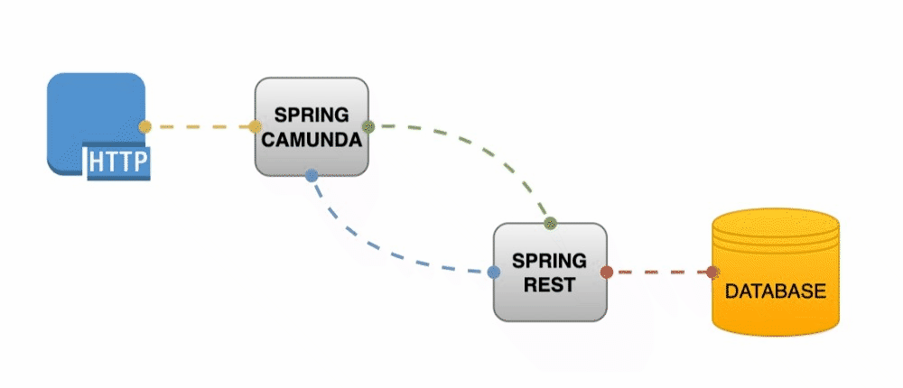
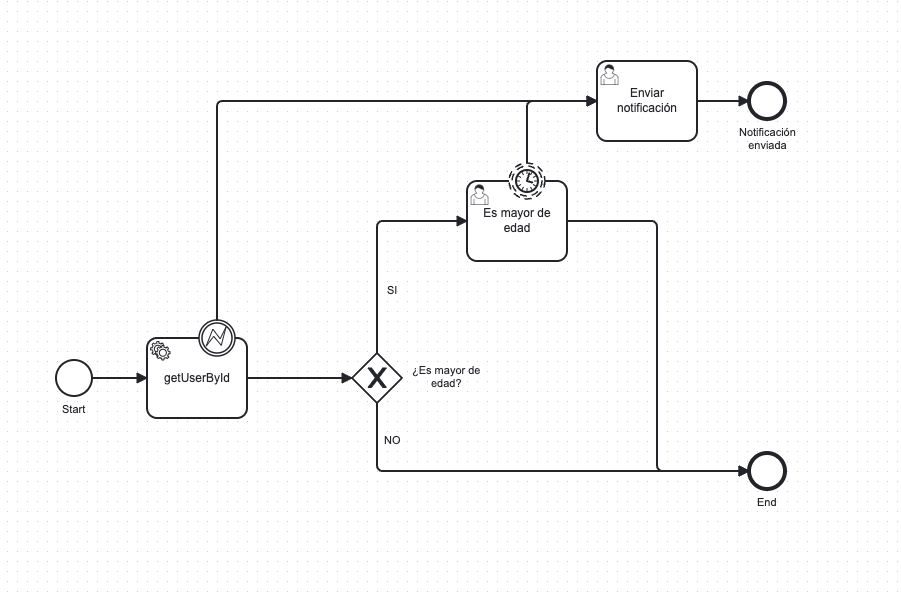

# spring-boot-camunda-http-task

## Stack

- SpringBoot 2.7.9 | 3.1.2
- JDK17
- Maven
- Postgres | h2
- Camunda 7.19.0
- Docker | Docker Compose


## Build (Opcional)

```shell
mvn clean package
```

## Run

```shell
docker-compose -f docker-compose.yaml -p spring-boot-camunda-http-task up -d --build
```

## Down

```shell
docker-compose.yaml -p spring-boot-camunda-http-task down --rmi local --remove-orphans --volumes
```


## Arquitectura


## Camunda workflow
